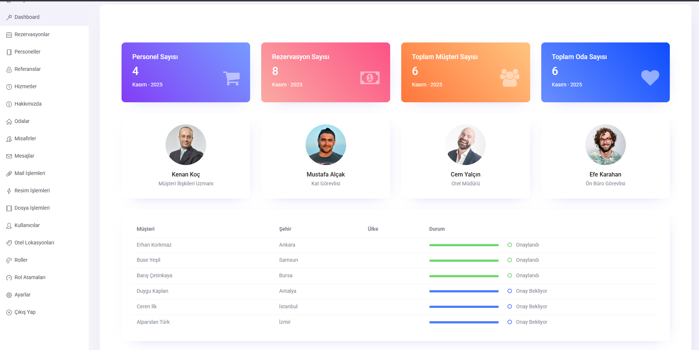
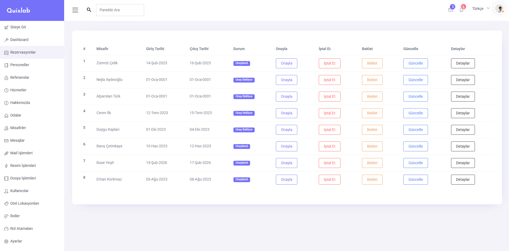
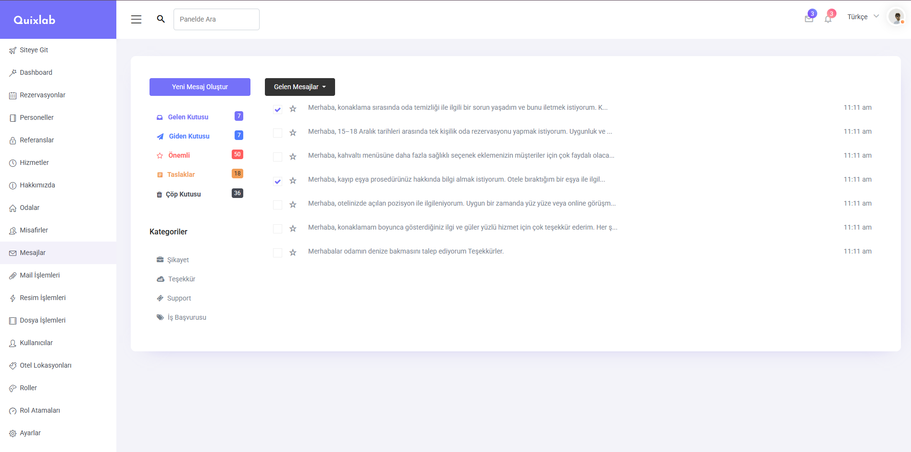
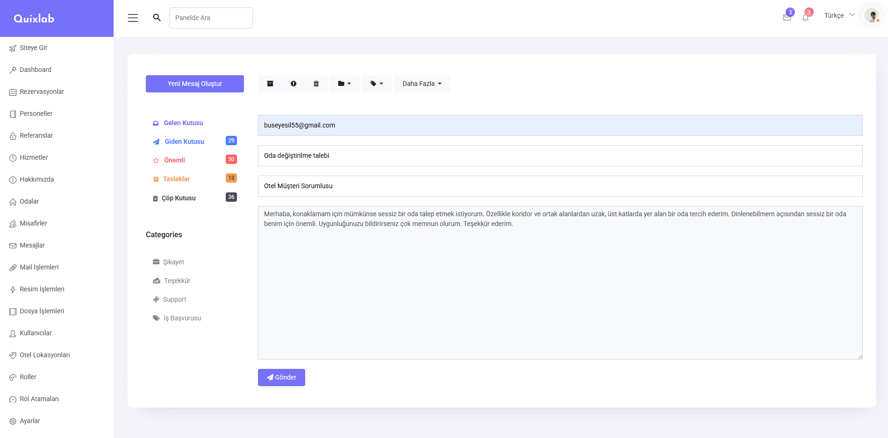
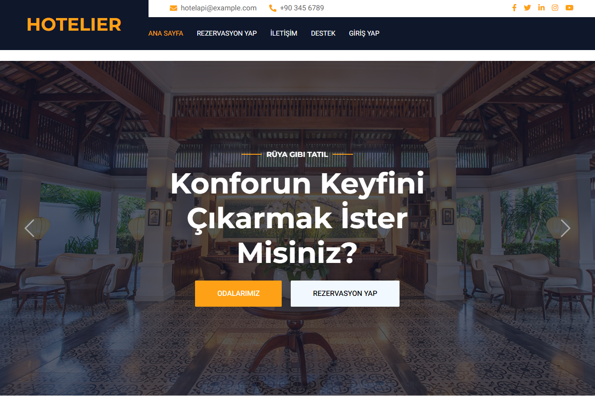
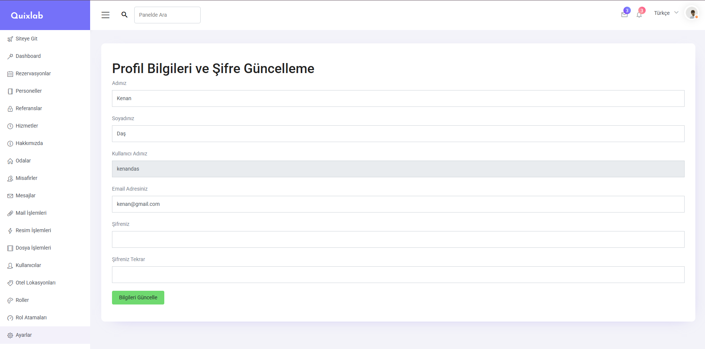

🏨 Hotelier Project - Otel Yönetim Sistemi

Modern otel işletmeleri için geliştirilmiş kapsamlı web tabanlı yönetim sistemi.
📋 Proje Hakkında
Hotelier Project, otel operasyonlarının dijital ortamda yönetilmesi, online rezervasyon alınması ve misafir deneyiminin geliştirilmesi için tasarlanmış profesyonel bir platformdur.
✨ Özellikler
🏢 Admin Paneli

Dashboard ile gerçek zamanlı istatistikler
Rezervasyon yönetimi (Onay/İptal/Beklemede)
Oda, personel ve kullanıcı yönetimi
Mesajlaşma sistemi (Gelen/Giden kutusu)
Rol bazlı yetkilendirme
Mail gönderme ve dosya yükleme

🌐 Kullanıcı Paneli

Modern ve responsive tasarım
Online rezervasyon sistemi
İletişim formu
Müşteri yorumları
Kullanıcı kayıt/giriş sistemi

🛠️ Kullanılan Teknolojiler

Backend

ASP.NET Core 5.0 (Web API & MVC)
Entity Framework Core (Code-First)
N-Tier Architecture
Repository & Generic Repository Pattern
ASP.NET Core Identity
AutoMapper
FluentValidation
SQL Server
LINQ

Frontend

HTML5, CSS3
JavaScript & jQuery
Bootstrap 5
Razor View Engine
ViewComponent

